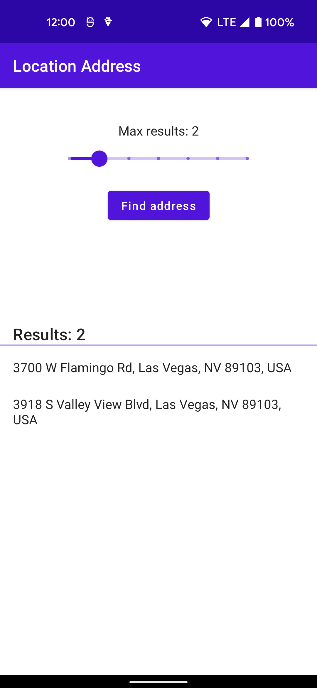

Location Address
================

Demonstrates how to use the [Geocoder API][geocoder] to display a device's
location as an address.

Introduction
------------

While latitude and longitude are useful for calculating distance or
displaying a map position, in many cases the address of the location is more
useful. The Android framework location APIs provide a `Geocoder` class with a
[`getFromLocation()`][get-from-location] method that returns an estimated
street address corresponding to a given latitude and longitude. This sample
uses the `getFromLocation()` method to do location address lookup. This is a
best-effort service and likely requires network connectivity.

**Warning:** Geocoding services may provide no guarantees on availability or
accuracy. Results are a best guess, and are not guaranteed to be meaningful or
correct. Do not use this API for any safety-critical or regulatory compliance
purpose.

Install and run
---------------

This sample uses the Gradle build system. To build this project, use the
`gradlew build` command or use "Import Project" in Android Studio and run it
from there.

Location must be enabled on the target device and it must have Google Play
Services. If it does not, the app will show a UI with an error message.

When the app starts up, tap the **Find address** button. Accept the permission
for precise location when asked. The app will then get the current location and
lookup the street address and display the results.

You can adjust the maximum number of results using the slider (note that the
API may return fewer than the maximum).

Support
-------

- Stack Overflow: http://stackoverflow.com/questions/tagged/google-play-services

If you've found an error in this sample, please
[file an issue](https://github.com/android/location-samples/issues).

Patches are encouraged and may be submitted according to the instructions in
[CONTRIBUTING.md](../CONTRIBUTING.md).

[geocoder]: https://developer.android.com/reference/android/location/Geocoder
[get-from-location]: https://developer.android.com/reference/android/location/Geocoder#getFromLocation(double,%20double,%20int)
